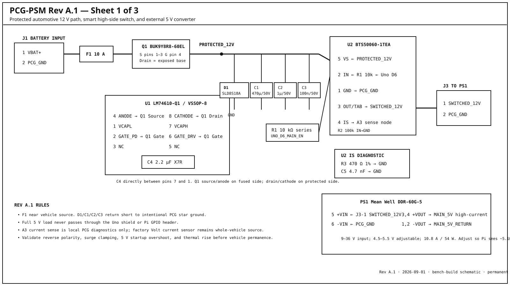
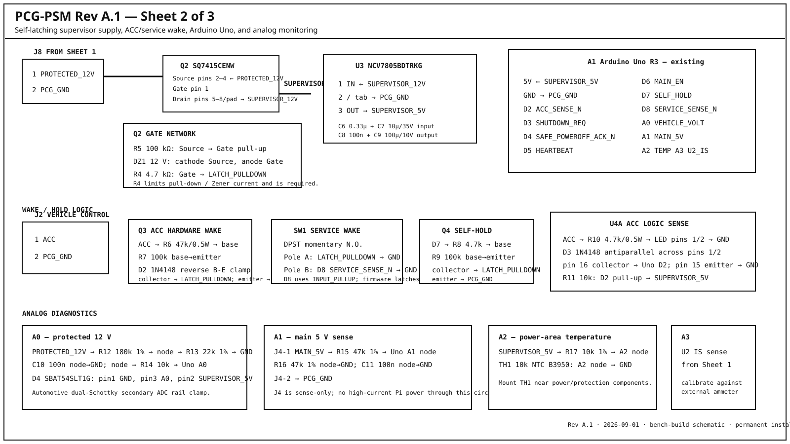
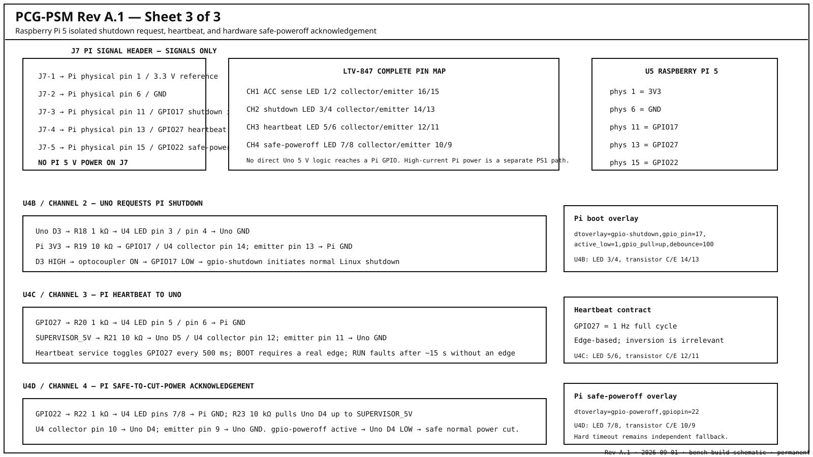

# PCG-PSM Rev A.1 Graphical Schematic

These drawings are the Rev A.1 bench-build schematic set for the Arduino Uno PCG-PSM prototype.

> **Status:** buildable bench schematic. Permanent automotive installation is still gated on reverse-polarity/transient testing, repeated power-cycle testing, watchdog testing, thermal testing, standby-current measurement, and in-vehicle validation.

## Sheet 1 — protected power path

Covers J1, F1, LM74610-Q1 / BUK9Y8R8-60EL reverse protection, SLD8S18A TVS, protected-bus capacitors, BTS50060 smart high-side switch, current-sense network, J3, and the external DDR-60G-5.

## Sheet 2 — supervisor and Uno

Covers Q2 self-latch, NCV7805 supervisor rail, ACC hardware wake, DPST service wake, Uno self-hold, ACC optocoupler, and A0/A1/A2/A3 diagnostic inputs.

## Sheet 3 — Raspberry Pi GPIO interface

Covers J7 and LTV-847 channels U4B/U4C/U4D for GPIO17 shutdown request, GPIO27 heartbeat, and GPIO22 `gpio-poweroff` safe-to-cut-power acknowledgement.

## Canonical text contract

The exact pin-by-pin connections, resistor/capacitor values, connector map, and bring-up order are maintained in [`../schematic.md`](../schematic.md).

The purchase BOM is maintained in [`../../bom/README.md`](../../bom/README.md) and [`../../bom/PROCUREMENT.md`](../../bom/PROCUREMENT.md).

## Rev A.1 design decisions captured here

- The main high-current switch is on the 12 V side of the external 5 V converter.
- Q2 gate includes a required 4.7 kΩ current-limiting resistor ahead of the shared latch pull-down node.
- SW1 is DPST momentary N.O.; one pole wakes the latch and the second provides an active-low D8 service indication.
- Firmware latches a service-boot request so SW1 does not need to remain held while Linux boots.
- U2 IS uses 470 Ω and 4.7 nF for diagnostic current sensing.
- A0 includes the automotive `SBAT54SLT1G` dual-Schottky clamp.
- Pi shutdown request is GPIO17 active-low through `gpio-shutdown`.
- Pi heartbeat is GPIO27 at 1 Hz.
- Normal permission to remove Pi power comes from GPIO22 `gpio-poweroff`, not an early userspace flag.
- No Pi 5 V power is carried on J7.